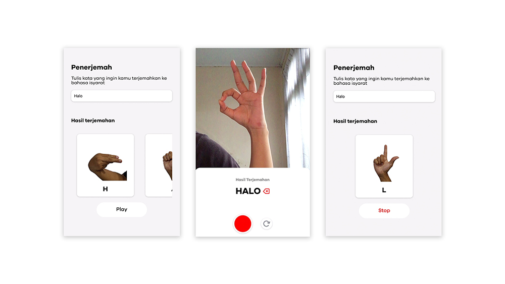
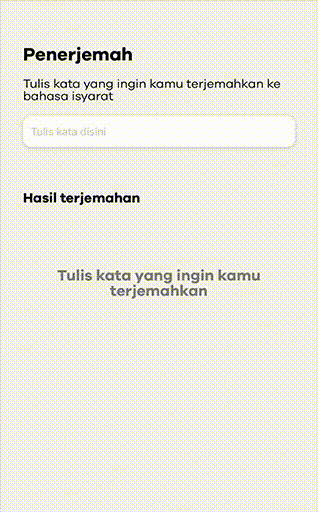

# SIBI Sign Language Recognizer
### 💡 About the App
This app is built to help people communicate with people with hearing disabilities in Indonesia, by using SIBI, an Indonesian standardized sign language system. The way it works is by constantly converting pictures taken by the app into alphabets, based on SIBI. This way, we can understand what the deaf people are trying to say through their gestures. We can also translate the a word to series of gesture slideshow in the app through its translation feature. This helps us make a reply, and practice sign language in the process

### 👀 Preview

###### Recognizer Interface

When starting the app, the first page a user will see is the recognizer page. User can point their camera on the person that performs the sign language, start the recording, and the app will convert it to alphabet.

###### Translator Interface

Another feature user can use is translator. This feature is used to translate a word into sign language in form of a slideshow. User can play this slideshow, or view the image in a sequence by dragging it.

### 👨🏻‍💻 Tech Stack
This app is fully built with React Native, with Expo environment. This app use Google Colab to run a Jupyter Notebook that acts as a temporary backend to receive image, convert it to alphabet, and return a string of alphabet as a result.